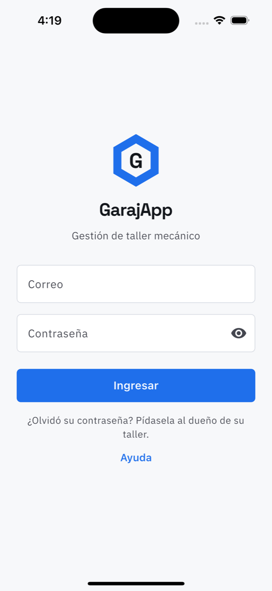
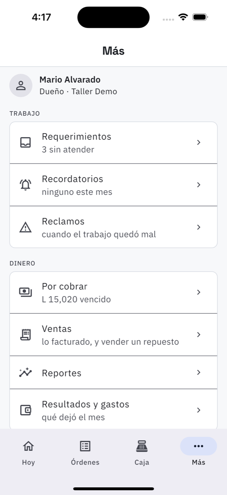
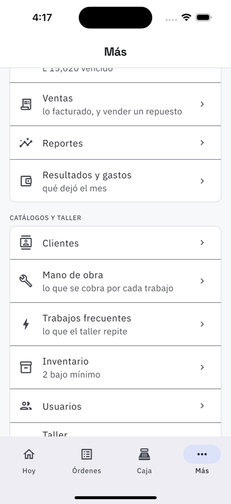

# 1. Entrar y moverse por la app

## Entrar

Se entra con el correo y la contraseña que le dio el taller. No hay registro: las cuentas las
crea el dueño desde [Usuarios](19-usuarios.md), y la del cliente desde
[Clientes](15-clientes.md).

La sesión queda abierta en el teléfono. «Salir» está en **Más → Salir**. Si olvidó la
contraseña, **se la cambia el dueño** desde [Usuarios](19-usuarios.md): la app no manda correos
de recuperación.

## Lo que ve cada quien

La app no es la misma para los tres perfiles, y no es una limitación: cada uno abre directo en
lo que vino a hacer.

| Perfil | Abre en | La barra de abajo |
| --- | --- | --- |
| Dueño | Hoy | Hoy · Órdenes · Caja · Más |
| Técnico | Mi trabajo | Mi trabajo · Repuestos · Más |
| Cliente | Mi vehículo | Mi vehículo · Historial · Más |

## La barra de abajo (dueño)

Las cuatro cosas que se tocan todo el día están en la barra: **Hoy** (el resumen),
**Órdenes** (lo que está en el taller), **Caja** (lo que entró hoy) y **Más**, que es el
índice de todo lo demás, agrupado en tres bloques:

- **Trabajo** — Requerimientos, Recordatorios, Reclamos.
- **Dinero** — Por cobrar, Ventas, Reportes, Resultados y gastos.
- **Catálogos y taller** — Clientes, Mano de obra, Trabajos frecuentes, Inventario, Usuarios,
  Taller.

Cada renglón lleva debajo el dato que importa hoy: «3 sin atender», «L 15,020 vencido»,
«2 bajo mínimo». Si no dice nada, no hay nada pendiente ahí.

Al final están **Ayuda y soporte**, **Política de privacidad**, **Califique la app**,
**Salir** y **Eliminar mi cuenta**.

## Cuando hay una versión nueva

- **Una franja arriba** con *Actualizar* y *Ahora no*: hay una versión más nueva, pero se puede
  seguir trabajando. Cerrada, no vuelve hasta la próxima vez que se abra la app.
- **Una pantalla que no deja pasar**: esa versión ya no funciona con el sistema. El botón abre la
  tienda; al actualizar se entra como siempre y **no se pierde nada de lo guardado**.

Si le sale la pantalla de bloqueo y no puede actualizar en ese momento, el panel web sigue
funcionando: es el mismo taller y los mismos datos.

## Dos detalles que ahorran preguntas

- **La campana** de arriba a la derecha son los [avisos](21-avisos.md); el número rojo es
  cuántos no ha leído.
- **Sin señal** la app lo dice y deja de insistir. Cuando vuelve la señal, se recarga sola al
  tirar de la lista hacia abajo.
