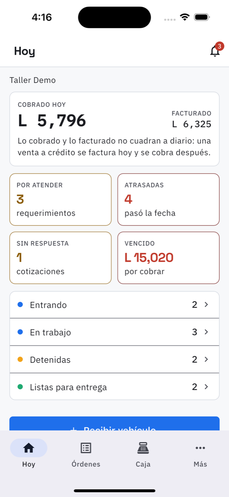

# 2. Hoy: el resumen del día

**Para qué sirve.** Es lo primero que abre el dueño en la mañana: qué entró, qué está
atrasado y cuánto se cobró, sin tener que buscarlo.

**Cómo llegar.** Es la primera pestaña de la barra de abajo.

## Qué dice cada parte

**Cobrado hoy / Facturado.** Dos números distintos a propósito. *Cobrado* es el dinero que
entró hoy a la caja; *facturado* es lo que se emitió hoy. Una venta a crédito se factura hoy y
se cobra después: por eso casi nunca cuadran, y no es un error.

**Las cuatro tarjetas.** Cada una es un pendiente y cada una se toca:

| Tarjeta | Qué cuenta | A dónde lleva |
| --- | --- | --- |
| Por atender | requerimientos que el cliente mandó y nadie ha aprobado | [Requerimientos](03-requerimientos.md) |
| Atrasadas | órdenes a las que se les pasó la fecha prometida | [Órdenes](05-ordenes.md) |
| Sin respuesta | cotizaciones mandadas que el cliente no ha contestado | [Órdenes](05-ordenes.md) |
| Vencido | facturas con saldo cuya fecha de pago ya pasó | [Por cobrar](11-por-cobrar.md) |

**La lista de estados.** Entrando, En trabajo, Detenidas, Listas para entrega, con cuántas hay
en cada uno. Al tocar un estado se abre la lista de órdenes filtrada por ese estado.

**Les toca servicio.** Si hay vehículos con servicio pendiente este mes, aparece el renglón y
lleva a [Recordatorios](08-recordatorios.md).

**Recibir vehículo.** El botón azul de abajo: es la entrada de un vehículo nuevo al taller.
Ver [Recibir un vehículo](04-recibir-vehiculo.md).
