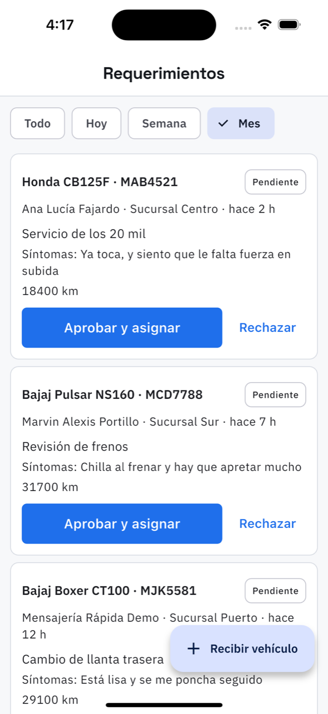

# 3. Requerimientos: las citas que pide el cliente

**Qué es.** Un requerimiento es la solicitud de servicio: «quiero llevar la moto, le pasa
esto». Puede llegar de tres sitios —el cliente desde su app, el mostrador escribiéndolo
cuando llaman, o el propio taller al recibir un vehículo— y no es todavía una orden de
trabajo: es lo que hay que aceptar o rechazar.

**Cómo llegar.** Más → Trabajo → **Requerimientos**. También desde la tarjeta
*Por atender* de [Hoy](02-hoy.md).

## La lista

Arriba los filtros por periodo: **Todo**, **Hoy**, **Semana**, **Mes**. Cada tarjeta trae el
vehículo, la placa, el cliente, la sucursal, hace cuánto llegó, el motivo, los síntomas que
escribió el cliente y el kilometraje.

El estado va a la derecha: **Pendiente** mientras nadie lo atienda.

## Las dos decisiones

**Aprobar y asignar.** Abre la orden de trabajo y pregunta **¿quién lo atiende?** con los
técnicos de esa sucursal. Dos salidas:

- Elegir un técnico: la orden nace asignada y le aparece en *Mi trabajo*.
- **Asignar después**: la orden se abre sin técnico y se le pone después desde el detalle.

Si la sucursal no tiene técnicos, lo dice y deja abrir la orden igual.

**Rechazar.** Pide el **motivo** y lo guarda. No es un borrado: el requerimiento queda con el
sello *Rechazado* y el motivo a la vista, y **el cliente lo ve** en su app. Conviene escribirlo
pensando en que lo va a leer él.

## Después de aprobar

La tarjeta cambia a **Ver orden CEN-000118**, que lleva directo a la
[orden](05-ordenes.md). De ahí en adelante el trabajo vive en la orden, no aquí.

## Si está vacío

«No hay requerimientos por atender» quiere decir que todo lo que llegó ya se aprobó o se
rechazó. Con un filtro puesto dice «No hay requerimientos en este periodo»: pruebe con
**Todo** antes de preocuparse.
