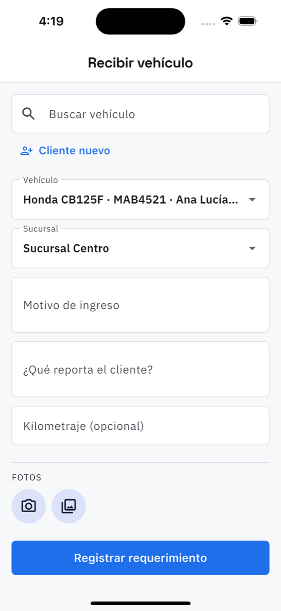

# 4. Recibir un vehículo

**Qué es.** La entrada del vehículo al taller. Es el mismo formulario que usa el cliente para
pedir cita desde su teléfono, pero llenado por el mostrador con el vehículo enfrente.

**Cómo llegar.** El botón **Recibir vehículo** de [Hoy](02-hoy.md), de la lista de
[Órdenes](05-ordenes.md) o de [Requerimientos](03-requerimientos.md).

## Llenarlo

1. **Buscar vehículo** — por placa, marca o nombre del cliente. Si ya vino antes, está aquí.
2. **Cliente nuevo** — si no está: nombre, teléfono, marca, modelo, placa. Ahí mismo se le
   puede **dar acceso a la app** (correo y contraseña de al menos 8 caracteres). Es opcional;
   la mayoría de los clientes nunca lo pide.
3. **Sucursal** — dónde queda el vehículo.
4. **Motivo de ingreso** — a qué viene. Es obligatorio.
5. **¿Qué reporta el cliente?** — con sus palabras: «chilla al frenar», «le falta fuerza en
   subida». Esto es lo que después se lee al diagnosticar.
6. **Kilometraje** — opcional, pero es lo que alimenta los
   [recordatorios de servicio](08-recordatorios.md).
7. **Fotos** — cámara o galería. Las golpes y rayones de antes se fotografían aquí: es lo que
   evita la discusión al entregar.

**Registrar requerimiento** lo manda al taller. De ahí sigue en
[Requerimientos](03-requerimientos.md), donde se aprueba y se convierte en orden.

## La hoja de recepción y la firma

Dentro de la orden hay una tarjeta aparte, **Recepción del vehículo**: combustible, golpes que
ya traía, lo que deja el cliente (casco, documentos, herramienta) y la **firma del cliente**
en la pantalla.

- Se firma con el dedo. La hoja no se mueve mientras se dibuja.
- **Deshacer** quita el último trazo; **Borrar** limpia todo.
- Guardada, la firma queda visible al volver a abrir la orden, con la opción
  **Firmar de nuevo** si hizo falta rehacerla.

Es opcional, pero es la prueba de en qué estado entró el vehículo.
