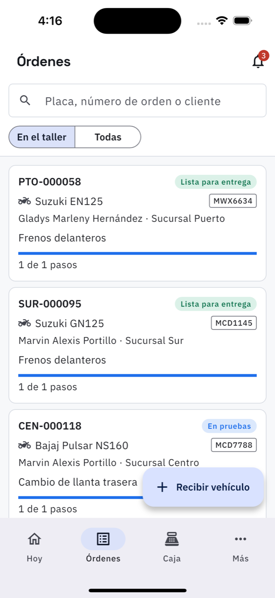
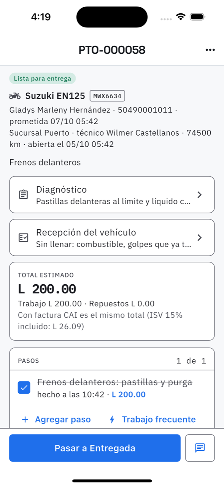
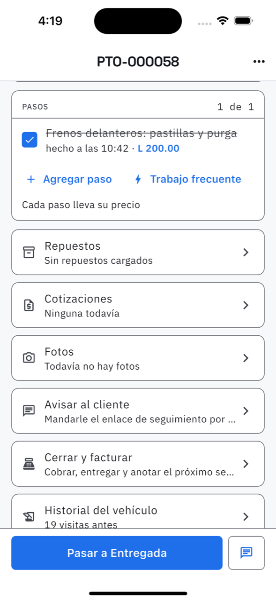
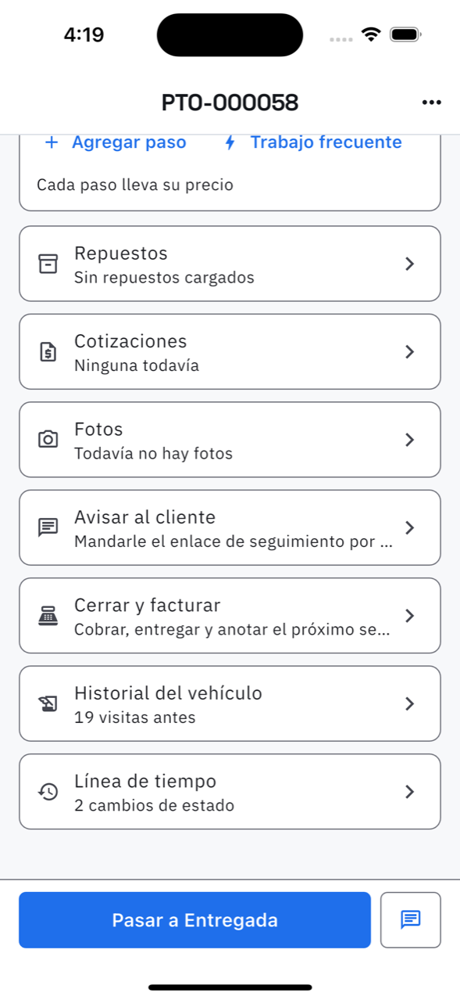

# 5. Órdenes: la lista y el detalle

La orden de trabajo es el centro del sistema: ahí viven los pasos, los repuestos, las fotos,
la cotización, el diagnóstico y, al final, la factura.

## La lista

**Cómo llegar.** Segunda pestaña de la barra de abajo.

- **El buscador** encuentra por placa, número de orden o nombre del cliente. Teclee y la
  lista se filtra sola; la **X** limpia la búsqueda.
- **En el taller / Todas.** *En el taller* son las órdenes vivas —lo que está adentro ahora
  mismo—. *Todas* incluye las entregadas y las canceladas.
- Cada tarjeta: número de orden, estado con su color, vehículo, placa, cliente, sucursal, el
  motivo y la barra de avance con *X de Y pasos*.
- El botón **Recibir vehículo** abre la entrada de un vehículo nuevo.

## Los estados

| Estado | Qué significa |
| --- | --- |
| Recibida | el vehículo entró, nadie lo ha revisado |
| En diagnóstico | lo están revisando |
| Esperando aprobación | se mandó cotización y falta que el cliente conteste |
| Esperando repuestos | detenida por una pieza que no hay |
| En proceso | lo están reparando |
| En pruebas | ya se reparó, lo están probando |
| Lista para entrega | terminada, falta que la recojan |
| Entregada | se entregó (y normalmente se facturó) |
| Cancelada | no se hizo el trabajo |

Las dos de en medio —*Esperando aprobación* y *Esperando repuestos*— son las «detenidas»:
el taller no puede avanzar hasta que conteste alguien de fuera.

## El detalle, de arriba abajo

**La cabecera.** Estado, vehículo, placa, cliente y teléfono, fecha prometida, sucursal,
técnico, kilometraje de entrada y cuándo se abrió. Si se pasó la fecha, lo dice en rojo:
*Atrasada 3 días*.

**Diagnóstico.** Lo que se encontró al revisar: causa, qué hay que cambiar, qué se
recomienda. Mientras esté vacío dice «Sin escribir».

**Recepción del vehículo.** La hoja de entrada y la firma — ver
[Recibir un vehículo](04-recibir-vehiculo.md).

**Total estimado.** Trabajo + repuestos, y cuánto ISV lleva dentro. Es estimado porque la
orden sigue abierta: el número final es el de la factura. El dueño ve además la **ganancia
estimada**; el técnico la ve solo si el dueño lo permitió en
[Ajustes del taller](20-ajustes-del-taller.md).

### Pasos

Cada paso es una cosa que hay que hacer. Se marca con el cuadrito cuando queda hecha y se
tacha, con la hora y el precio.

**Agregar paso** abre una sola hoja con tres maneras de cobrarlo:

| Cómo se cobra | Cuándo se usa |
| --- | --- |
| **Del catálogo** | el trabajo ya está en [Mano de obra](17-mano-de-obra.md). Se elige de la lista y el nombre y el precio salen solos: no hay que escribir nada más |
| **Precio a mano** | un trabajo que no está en el catálogo. Se escribe el nombre y el precio |
| **Sin cobro** | el paso se hace pero no se cobra aparte: va dentro de otro trabajo |

Con *precio a mano* hay dos preguntas más:

- **¿Dónde va el precio?** — *En este paso* (cada paso lleva lo suyo) o *Un total al final*
  (se cobra un solo total por toda la orden y se lo pide al agregar el paso).
- **¿Guardarlo en el catálogo?** — viene **desmarcado**. Si lo marca, el trabajo queda en
  Mano de obra para la próxima vez. Antes de guardarlo la app revisa si ya hay uno parecido y
  avisa: *«Ya está en el catálogo: "Cambio de aceite y filtro" a L 450.00. Toque para
  usarlo»*, para no terminar con cinco versiones del mismo trabajo.

> **Si cambia a «un total al final» teniendo pasos con precio**, la app avisa: esos precios
> **dejan de contar —no se borran—** y a la factura va solo el total que escriba. Si vuelve a
> «cada paso lleva su precio», esos precios vuelven a contar tal cual estaban.

**Trabajo frecuente** anexa de un toque todos los pasos y repuestos de una plantilla; no
reemplaza lo que la orden ya tenga. Ver [Trabajos frecuentes](18-trabajos-frecuentes.md).

### Repuestos

Lo que se le instaló al vehículo. **Cárguelos al usarlos, no antes**: al cargar un repuesto
sale de la bodega en ese momento. La app muestra cuántos quedan en esa sucursal.

Un repuesto que el taller no tiene se puede cargar **fuera del catálogo**, con su precio, y se
marca si se compra en casa de repuestos.

### Cotizaciones

Para cuando el trabajo hay que aprobarlo antes de hacerlo. Ver
[Cotizaciones](06-cotizaciones.md).

### Fotos

Las del antes, el durante y el después. Se toman con la cámara o se suben de la galería, y el
cliente las ve en su seguimiento.

### Avisar al cliente

Manda por WhatsApp el enlace de seguimiento. El cliente **no necesita instalar nada**: abre
una página con el avance de su vehículo.

### Cerrar y facturar

Es el cierre: se cobra, se entrega y se anota el próximo servicio. Ahí se elige la forma de
pago, si va con **factura CAI** o comprobante, y la fecha del próximo mantenimiento, que es
la que después aparece en [Recordatorios](08-recordatorios.md).

Con factura CAI **el total es el mismo**: el ISV ya va dentro del precio.

### Historial del vehículo y línea de tiempo

*Historial* son las visitas anteriores de ese mismo vehículo. *Línea de tiempo* es quién
cambió el estado y cuándo — es lo que contesta «¿y esto desde cuándo está detenido?».

## El botón de abajo

Siempre propone el paso siguiente natural: **Pasar a En proceso**, **Pasar a Lista para
entrega**, **Pasar a Entregada**. En **Más acciones** (los tres puntos de arriba) están
*Detener el trabajo* —esperando repuestos o aprobación, avisándole al cliente—, *Asignar
técnico*, *Guardar como trabajo frecuente* y *Cancelar la orden*.

## Reabrir una orden entregada

Cuando el trabajo quedó mal y el vehículo vuelve, la orden se reabre en vez de abrir una nueva
que no diga de dónde viene: **Más acciones → Reabrir la orden**. Vuelve a *En proceso*, se
puede volver a trabajar y a facturar, y el motivo queda en la línea de tiempo.

Dos cosas que la app exige antes:

- **La factura tiene que estar anulada.** Con la factura viva serían dos cobros por el mismo
  trabajo. La app lo dice y nombra cuál anular — se anula desde [Ventas](10-ventas.md).
- **El plazo.** Se puede reabrir mientras corra la **garantía que se le dio al trabajo**, y
  nunca menos de 15 días desde la entrega. Pasado eso, el trabajo de hoy ya no es el de
  aquella orden: se abre una nueva.

Después de rehacerlo se vuelve a facturar como siempre, con *Cerrar y facturar*. La factura
nueva toma su propio número; la anulada queda registrada como anulada, que es lo que
corresponde.

## Si la orden viene de un reclamo

Aparece un recuadro **Viene del reclamo REC-000002** con la decisión de garantía. Mientras no
se diga si la cubre la garantía, **la orden no se puede facturar**. Ver
[Reclamos](07-reclamos.md).
