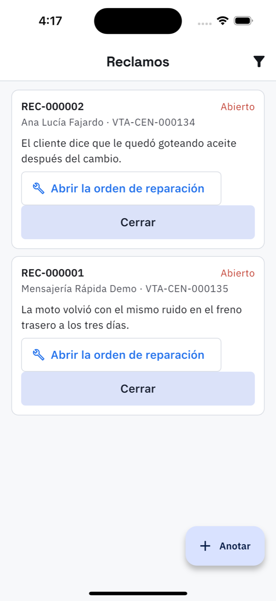

# 7. Reclamos y garantía

**Qué es.** Un reclamo se anota cuando el cliente vuelve diciendo que el trabajo quedó mal.
Queda escrito qué pasó, qué se hizo y si entró en garantía — que es lo que después se consulta
cuando nadie se acuerda.

**Cómo llegar.** Más → Trabajo → **Reclamos**. El embudo de arriba filtra
**ver solo los abiertos**.

## Anotarlo

**Anotar**, y pide dos cosas:

1. **Sobre qué trabajo** — se busca por factura, número de orden o nombre del cliente.
2. **Qué dice el cliente que pasó** — con sus palabras. Es lo que se lee después cuando hay
   que decidir.

El reclamo nace **Abierto** y toma su número: REC-000001.

## Las dos salidas

### Abrir la orden de reparación

Crea una orden nueva ligada al reclamo, con sus propios pasos y repuestos. El reclamo
**sigue abierto** mientras la reparación esté en curso: es la orden la que dice cuánto costó.

En esa orden aparece arriba el recuadro **Viene del reclamo REC-000001** con la pregunta que
hay que contestar:

| Decisión | Qué implica |
| --- | --- |
| **La cubre la garantía** | la paga el taller: no se le factura nada al cliente |
| **No la cubre** | es un servicio nuevo y se le cobra normal |

> Mientras no se conteste, **la orden no se puede facturar**. La app lo dice al intentarlo:
> *«Antes de cobrar, diga si el reclamo lo cubre la garantía o no»*. Y si se marcó como
> garantía, tampoco deja facturar: se entrega y se pasa a *Entregada*.

Cuando la orden se entrega, en ella misma aparece **Cerrar el reclamo REC-000001**, que lo
cierra con el resultado que corresponde: *Reparado en garantía* o *Reparado y cobrado*.

### Cerrarlo sin orden

**Cerrar** pide **cómo termina** y **qué se hizo**:

- **Reparado en garantía** — lo asumió el taller.
- **Reparado y cobrado** — se arregló y se le cobró.
- **No procede** — el reclamo no tenía fundamento.

Un reclamo cerrado se puede **Reabrir** si el cliente vuelve con lo mismo.

## Lo que queda registrado

En la lista se lee de un vistazo: el número, el cliente, la factura original, lo que dijo el
cliente, y abajo *«Se hizo: …»* más si estaba en garantía el día que reclamó. Esa última línea
no es automática: la decide el taller con el diagnóstico hecho.
