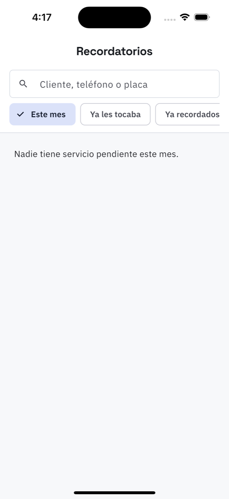

# 8. Recordatorios de servicio

**Qué es.** A quién le toca servicio. Sale de lo que se anotó al facturar, en
*próximo servicio*: una fecha («le toca el 12 de noviembre»), un kilometraje («a los 25,000
km») o las dos cosas.

**Cómo llegar.** Más → Trabajo → **Recordatorios**, o el renglón *les toca* de
[Hoy](02-hoy.md).

## Los filtros

| Filtro | Qué muestra |
| --- | --- |
| **Este mes** | a quién le toca dentro de los próximos 30 días |
| **Ya les tocaba** | los atrasados: pasó la fecha y no han venido |
| **Ya recordados** | a los que ya se les escribió, para no repetir |

El buscador encuentra por cliente, teléfono o placa.

## Cada renglón

El vehículo con su placa, el cliente, qué se le hizo la última vez y en qué orden, la última
lectura de kilometraje, y cuándo le toca: *le toca hoy*, *le toca en 6 días*, *le tocaba hace
12 días*.

## Recordar por WhatsApp

El botón abre WhatsApp con el mensaje escrito y el teléfono del cliente. Al mandarlo, el
renglón queda marcado como **Ya se le recordó** y sale de la lista principal: así dos personas
del mostrador no le escriben lo mismo al mismo cliente.

> En la captura no hay nadie porque en el taller de demostración ningún vehículo tiene
> servicio dentro de los próximos 30 días. Con trabajo facturado y su próximo servicio
> anotado, aquí aparece la lista.
