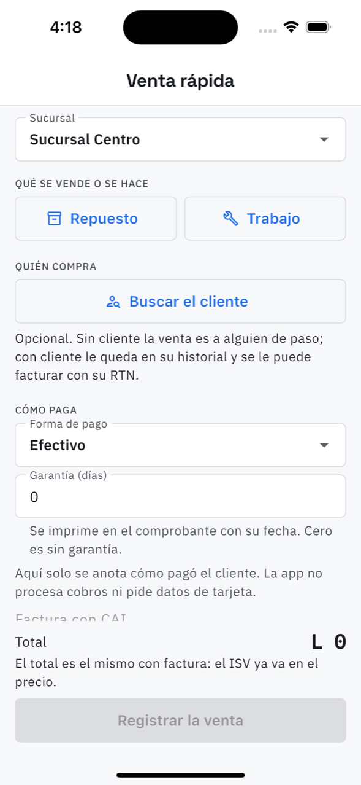

# 9. Venta de mostrador

**Qué es.** Vender sin abrir una orden: el que llega por un litro de aceite, o el trabajito de
diez minutos que no vale la pena registrar como reparación.

**Cómo llegar.** Más → Dinero → Ventas → **Venta rápida**, o el botón del mismo nombre en la
lista de [Ventas](10-ventas.md).

## Llenarla

**1. Sucursal.** De cuál bodega sale el repuesto.

**2. Qué se vende o se hace.** Dos caminos, y se ve uno a la vez:

- **Repuesto** — se busca en el catálogo por nombre o código, se pone la cantidad y se
  agrega. La app muestra cuántos quedan: al registrar la venta salen de la bodega.
- **Trabajo** — un trabajo del catálogo de [Mano de obra](17-mano-de-obra.md), o escrito a
  mano con su precio.

Se pueden mezclar varias líneas en la misma venta.

**3. Quién compra.** Opcional:

- Sin cliente, la venta es **a alguien de paso**.
- Con cliente, le queda en su historial y se le puede facturar con su RTN.
- Si el cliente no está registrado, **Cliente nuevo** lo da de alta ahí mismo con nombre y
  teléfono, sin salir de la venta.

**4. Cómo paga.** Forma de pago y **garantía en días**, que se imprime en el comprobante con
su fecha. Cero es sin garantía.

> Aquí solo se **anota** cómo pagó el cliente. La app no procesa cobros ni pide datos de
> tarjeta.

**5. Factura con CAI** o comprobante de entrega. Con CAI consume el número siguiente del rango
autorizado de esa sucursal, y lo dice antes de registrar. Si el CAI venció, la app lo avisa y
no deja usarlo.

**El total es el mismo con factura o sin ella**: el ISV ya va dentro del precio.

## Al registrarla

Sale el número (VTA-CEN-000136), queda en [Ventas](10-ventas.md), descuenta la bodega y entra
en el [cierre de caja](12-caja.md) del día. El comprobante se puede compartir en PDF.
