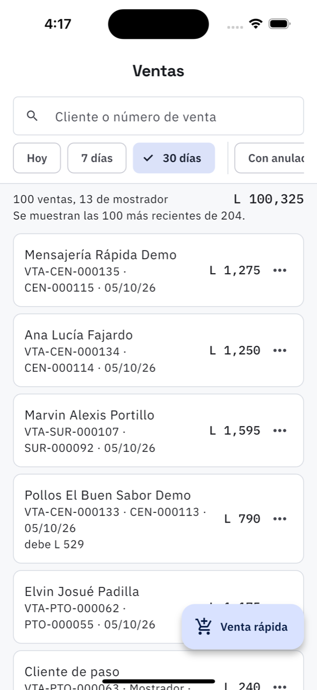

# 10. Ventas

**Qué es.** Todo lo facturado: las ventas que salieron de una orden y las de mostrador.

**Cómo llegar.** Más → Dinero → **Ventas**.

## La lista

- **Buscador** por cliente o número de venta.
- **Periodo**: Hoy, 7 días, 30 días.
- **Con anuladas** las incluye; por defecto no se ven.
- **Todas las sucursales** o una sola.

Arriba, el resumen del periodo: *100 ventas, 13 de mostrador · L 100,325*. Cuando hay más de
las que caben, lo dice: *«Se muestran las 100 más recientes de 204»* — hay que afinar el
filtro o buscar.

Cada renglón trae el cliente (o *Cliente de paso*), el número de venta, la orden de la que
salió, la fecha y el total. Si quedó debiendo, lo dice en rojo: *debe L 529*.

## Lo que se puede hacer con una venta

En los tres puntos de cada renglón:

- **Ver la orden** de la que salió.
- **Bajar el comprobante** en PDF, para mandarlo o imprimirlo.
- **Anular.** Pide el motivo, que queda guardado. La venta **conserva su número** —no se
  borra, que para eso es fiscal— y **los repuestos vuelven a la bodega**.

  Hay plazo, y no es por comodidad: es por el mes fiscal.

  | | Hasta cuándo se puede anular |
  | --- | --- |
  | Factura con CAI | el último día del mes en que se emitió |
  | Comprobante sin CAI | 30 días |

  Pasado el plazo la app no deja: una factura de un mes ya declarado no se arregla anulando,
  se arregla con una nota de crédito.

  Si el cliente **ya había abonado**, antes de anular hay que escribir qué se hizo con ese
  dinero —si se le devolvió o si se aplica a la factura nueva—. Sin esa línea, el descuadre de
  caja aparece un mes después y ya nadie se acuerda.

## Dónde encaja

Lo que se cobró de estas ventas aparece en el [cierre de caja](12-caja.md) del día; lo que
quedó debiendo, en [Por cobrar](11-por-cobrar.md); y el resumen del mes, en
[Reportes](13-reportes.md).
