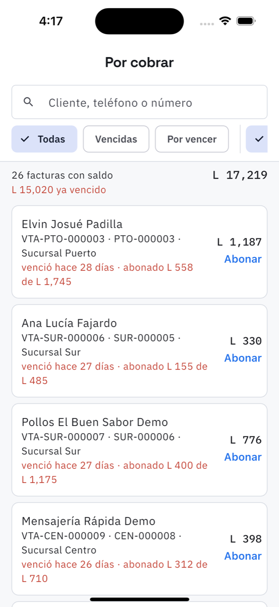

# 11. Por cobrar

**Qué es.** Lo facturado que todavía no entró en caja. Lo que vence antes va primero.

**Cómo llegar.** Más → Dinero → **Por cobrar**, o la tarjeta *Vencido* de [Hoy](02-hoy.md).

## La lista

Arriba el total: *26 facturas con saldo · L 17,219*, y debajo en rojo cuánto de eso **ya
venció**.

Filtros: **Todas**, **Vencidas**, **Por vencer**, y por sucursal. El buscador encuentra por
cliente, teléfono o número.

Cada renglón: cliente, número de venta, número de orden, sucursal, el saldo en grande y, en
rojo, hace cuántos días venció y cuánto ha abonado de cuánto.

## Registrar un abono

**Abonar** abre la hoja de cobro:

- **Cuánto abona** — no puede pasar del saldo; la app lo frena.
- **Forma de pago** — efectivo, tarjeta, transferencia, otro.
- **Referencia** (opcional) — número de recibo, depósito o transferencia.

Al guardarlo, el saldo baja, el abono entra en el [cierre de caja](12-caja.md) del día y queda
en la lista de **abonos** de esa factura, con fecha, forma de pago y referencia.

## Mandar estado de cuenta

Arma por WhatsApp el resumen de lo que debe ese cliente —**todas** sus facturas con saldo, no
solo la que está viendo— y se lo manda.
