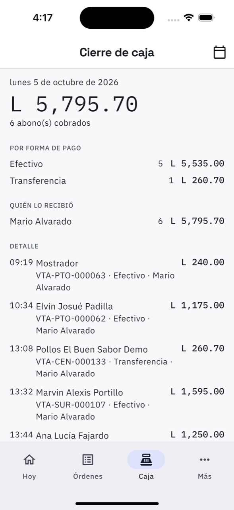

# 12. Cierre de caja

**Qué es.** Cuánto dinero entró en el día y por dónde. Es lo que se cuadra contra lo que hay
en la gaveta antes de cerrar.

**Cómo llegar.** Tercera pestaña de la barra de abajo.

## Qué muestra

**El total del día** en grande, con cuántos cobros lo componen. El calendario de arriba a la
derecha cambia de día: sirve para cuadrar el de ayer.

**Por forma de pago.** Efectivo, tarjeta, transferencia, otro: cuántos cobros y cuánto en cada
uno. Es la línea que se compara con el efectivo contado.

**Quién lo recibió.** Cuánto cobró cada persona. En un taller con dos personas en el
mostrador, esto es lo que dice de quién es cada faltante.

**Detalle.** Cobro por cobro, con la hora, el cliente (o *Mostrador*), el número de venta, la
forma de pago y quién lo recibió.

## Lo que no cuenta

- Las ventas **anuladas** se dejan fuera, y lo dice: *«Se dejaron fuera 1 abono por L 240 de
  ventas anuladas»*.
- Lo facturado a crédito **no entra** aquí hasta que se cobre: eso vive en
  [Por cobrar](11-por-cobrar.md).

Por eso el cierre de caja y lo facturado del día casi nunca son el mismo número.
