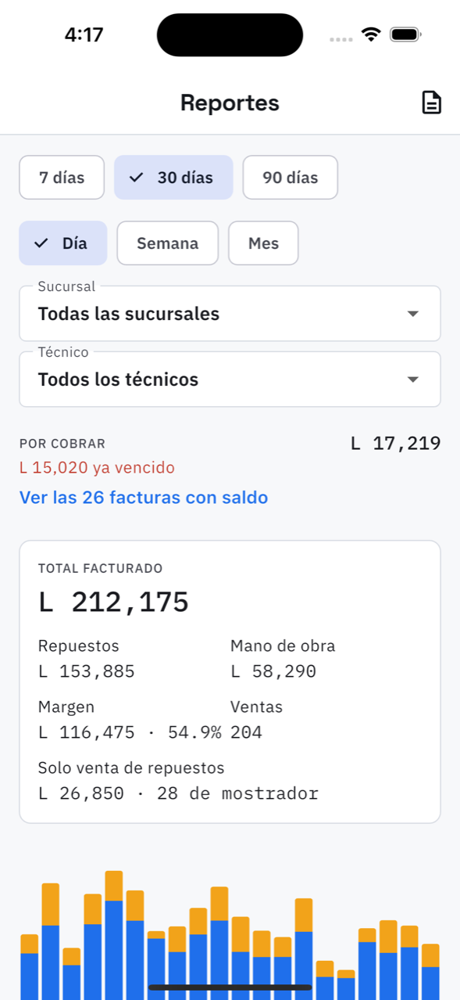

# 13. Reportes

**Qué es.** La forma del negocio: cuánto se facturó, cuánto dejó, quién lo hizo y qué se vende
más.

**Cómo llegar.** Más → Dinero → **Reportes**.

## Los filtros

- **Periodo**: 7, 30 o 90 días.
- **Agrupar por**: día, semana o mes — es lo que cambia la gráfica.
- **Sucursal** y **Técnico**: todas o una sola. El trabajo sin técnico asignado aparece como
  *Sin técnico*.

## Qué muestra

**Por cobrar**, arriba del todo, con cuánto ya venció y un enlace directo a
[las facturas con saldo](11-por-cobrar.md).

**Total facturado** del periodo, repartido en:

| | |
| --- | --- |
| Repuestos | lo que se vendió en piezas |
| Mano de obra | lo que se cobró por trabajo |
| Margen | lo que quedó después del costo de los repuestos, y el porcentaje |
| Ventas | cuántas facturas |
| Solo venta de repuestos | cuánto de todo eso fue mostrador |

**La gráfica** apila repuestos y mano de obra por día, semana o mes. Es la que enseña los
lunes cargados y los sábados a medias.

**Por sucursal** y **Por técnico**: cuánto facturó cada uno, con su mano de obra aparte.

**Repuestos más vendidos**: el SKU y cuántas unidades salieron.

## El libro de ventas

El icono de arriba a la derecha baja el **libro de ventas del mes** en CSV, para el contador o
para la declaración. Se abre en Excel.

> El margen de aquí es **bruto**: facturado menos el costo de los repuestos. Lo que de verdad
> dejó el mes, después del alquiler y la planilla, está en
> [Resultados y gastos](14-resultados-y-gastos.md).
