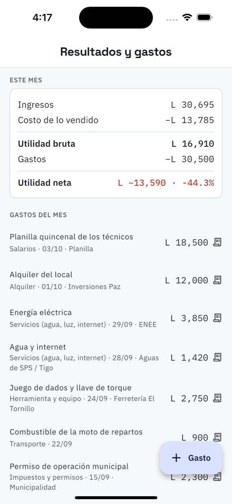

# 14. Resultados y gastos



**Qué es.** Qué dejó el mes de verdad, y dónde anotar lo que se gasta.

**Cómo llegar.** Más → Dinero → **Resultados y gastos**.

## El estado del mes

```
Ingresos              lo facturado
− Costo de lo vendido lo que costaron los repuestos que salieron
= Utilidad bruta
− Gastos              lo que anotó abajo
= Utilidad neta       y el porcentaje
```

**Si la utilidad neta sale en rojo no es un error de la app.** En la captura el taller lleva
L 30,500 de gastos contra L 16,910 de utilidad bruta porque la planilla y el alquiler del mes
se anotaron completos y el mes apenas empieza. El número es tan real como lo que se le anote:
*«anote alquiler, salarios y servicios para que el número sea real»*.

## Anotar un gasto

El botón **Gasto** abre el formulario:

| Campo | Para qué |
| --- | --- |
| Sucursal | de cuál taller salió |
| Categoría | Salarios, Alquiler, Servicios, Herramienta, Transporte, Impuestos y permisos, Publicidad, Mantenimiento del local, Otros |
| En qué se gastó | la descripción que se lee después en la lista |
| Monto | |
| Forma de pago | efectivo, tarjeta, transferencia, otro |
| A quién se le pagó | opcional: el proveedor |
| Comprobante | una foto del recibo |

> **La compra de repuestos no es un gasto aquí.** Eso es inventario: entra por
> [Inventario](16-inventario.md) como *entrada por compra* y se vuelve costo cuando se vende.
> Anotarlo en los dos lados contaría el mismo dinero dos veces.

**Tome la foto del recibo.** Un gasto sin comprobante se puede discutir; con la foto, no.

## La lista de gastos del mes

Cada renglón: la descripción, la categoría, la fecha, el proveedor y el monto, con el icono
del comprobante si lo tiene. Se toca para ver el recibo o borrarlo.
