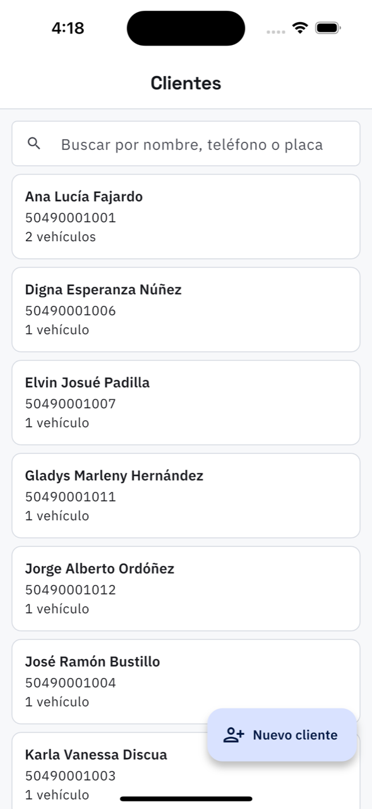

# 15. Clientes

**Qué es.** La libreta del taller: quién es, cómo se le llama, qué vehículos tiene.

**Cómo llegar.** Más → Catálogos y taller → **Clientes**.

## La lista

Buscador por **nombre, teléfono o placa** — la placa es lo que más se usa: el mostrador se
acuerda del vehículo antes que del dueño. Cada renglón trae el cliente, su teléfono, cuántos
vehículos tiene y su RTN si lo registró.

## La ficha

Al tocar un cliente se abren sus datos y sus **vehículos**, con marca, modelo, placa y el
último kilometraje. Desde ahí:

- **Llamar** marca el teléfono.
- **Editar** cambia los datos.

## Nuevo cliente

Solo el **nombre** y el **teléfono** son obligatorios. Lo demás es opcional y tiene su para
qué:

| Campo | Para qué |
| --- | --- |
| Correo | por donde se le manda la cotización |
| RTN | para la factura con CAI |
| Factura a nombre de | cuando la factura no va a su nombre, p. ej. el de su empresa |
| Dirección, Notas | lo que el taller quiera recordar |

## Darle acceso a la app

**Dar acceso** le crea usuario con un correo y una contraseña de al menos 8 caracteres, que
usted le entrega. Con eso el cliente puede **seguir la reparación de sus vehículos y aprobar
cotizaciones**. Nada más: no ve precios de otros, ni el taller por dentro.

Si ya tiene acceso, la ficha lo dice: *«Entra con ana@ejemplo.hn»*. La contraseña se cambia
desde [Usuarios](19-usuarios.md).
