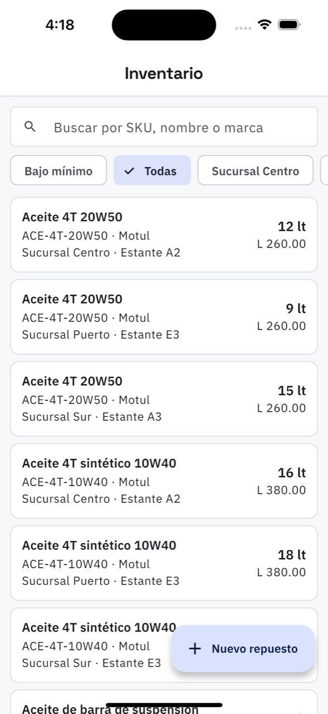

# 16. Inventario

**Qué es.** La bodega: qué repuesto hay, en qué sucursal, en qué estante y a cómo se vende.
El mismo repuesto aparece una vez por sucursal, porque la existencia es de cada una.

**Cómo llegar.** Más → Catálogos y taller → **Inventario**. El técnico lo tiene en su barra de
abajo, como **Repuestos**.

## La lista

Buscador por **SKU, nombre o marca**, y tres filtros: **Bajo mínimo**, **Todas** y una
sucursal a la vez.

Cada renglón: el nombre, el SKU, la marca, la sucursal y el estante, con la existencia y el
precio de venta a la derecha. Lo que está **bajo mínimo** se marca: es lo que hay que comprar.

## Las tres operaciones

**Entrada por compra.** Lo que llegó del proveedor: cantidad, costo unitario y referencia de
la factura. **Actualiza el costo de referencia del catálogo**, que es lo que después se usa
para calcular el margen.

**Ajuste por conteo.** Cuando lo contado no coincide con lo que dice el sistema: se escribe lo
que se contó y el motivo. Obliga a poner el motivo a propósito — un faltante sin explicación
es lo que después nadie puede reconstruir.

**Traslado.** Mandar piezas de una sucursal a otra. Sale de una y entra en la otra, con quién
lo hizo y cuándo.

## El kardex

Al tocar un repuesto se ve su historia: cada entrada y cada salida con fecha, quién la hizo,
la orden o la venta de la que salió, la referencia y las notas. Es lo que contesta «¿y este
aceite dónde se fue?».

## Nuevo repuesto

El **SKU** y el **nombre** son obligatorios. Lo demás: marca, categoría, unidad (unidad,
litro, juego…), ubicación en la bodega, costo, precio de venta y el **mínimo**, que es el que
dispara la alerta de *bajo mínimo*.

> La existencia **no se escribe a mano** al crear el repuesto: se registra con una
> *entrada por compra*, para que quede el movimiento y el costo.
