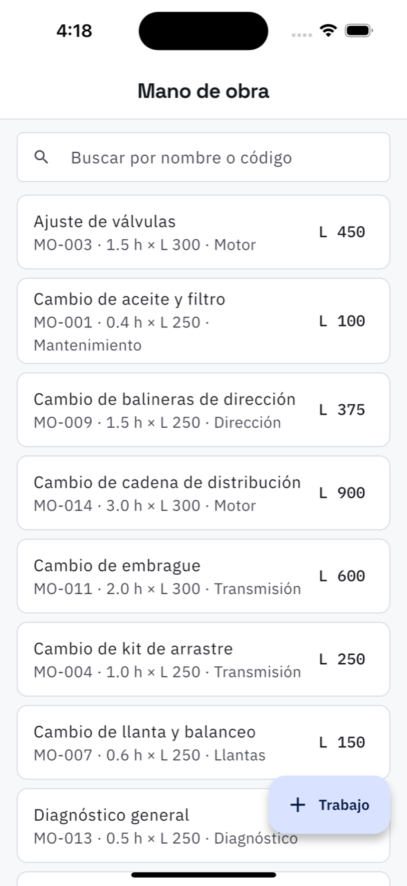

# 17. Mano de obra

**Qué es.** El catálogo de lo que cobra el taller por trabajo: el cambio de aceite, la
revisión de frenos, lo de todos los días. Tenerlo lleno es lo que hace que armar una orden sea
elegir de una lista en vez de escribir y calcular.

**Cómo llegar.** Más → Catálogos y taller → **Mano de obra**.

## La lista

Buscador por nombre o código. Cada renglón: el trabajo, su código, cómo se calcula el precio
y la categoría, con el precio a la derecha.

## Nuevo trabajo

| Campo | Qué poner |
| --- | --- |
| **Qué trabajo es** | «Cambio de aceite y filtro» |
| **Código** | para encontrarlo rápido. Cualquier cosa corta sirve: MO-001, ACE-01 |
| **Categoría** | opcional: Motor, Frenos, Transmisión… |

Y cómo se cobra, que son dos maneras:

- **Por hora** — horas estándar × tarifa por hora. El precio sale de multiplicar.
- **Precio cerrado** — se cobra lo mismo tarde lo que tarde.

> **El precio del catálogo es el precio final**, con el ISV ya dentro. No se le suma nada
> después.

## Dar de baja un trabajo

Un trabajo desactivado **no se puede elegir en una orden nueva**, pero las órdenes que ya lo
llevan no cambian: lo que se cobró, se cobró. Es para limpiar el catálogo sin tocar la
historia.

## De dónde más sale el catálogo

Cuando se agrega un paso **a mano** en una orden o en un trabajo frecuente, hay una casilla
*Guardarlo en el catálogo*. Viene desmarcada, y antes de guardar avisa si ya existe uno
parecido, para no terminar con «Cambio de aceite», «cambio aceite» y «Camb. aceite» como tres
trabajos distintos.
