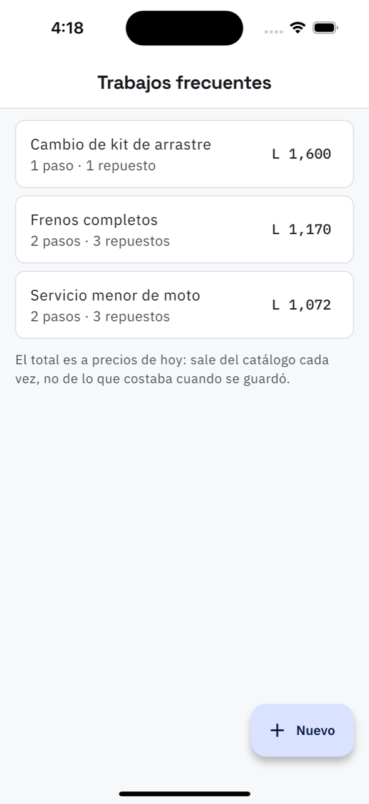

# 18. Trabajos frecuentes

**Qué es.** Lo que el taller repite, guardado completo: sus pasos y sus repuestos. El
«servicio menor de moto» son dos pasos y tres repuestos; con la plantilla, es un toque dentro
de la orden en vez de armarlo otra vez.

**Cómo llegar.** Más → Catálogos y taller → **Trabajos frecuentes**.

## La lista

Cada plantilla con cuántos pasos y cuántos repuestos lleva, y su total. **El total es a
precios de hoy**: sale del catálogo cada vez que se abre la pantalla, no de lo que costaba
cuando se guardó. Si sube el aceite, sube la plantilla sola.

## Armar una

**Nuevo** pide el nombre («Servicio menor de moto»), una descripción opcional y si está
activo. Luego se le agregan:

**Agregar paso** — con las mismas tres maneras que en la orden:

- **Del catálogo** — se elige el trabajo y el nombre y el precio salen solos.
- **Precio a mano** — nombre y precio escritos, y se decide si el precio va *en este paso* o
  si se fija *un total al final*.
- **Sin cobro** — el paso se hace pero no se cobra aparte.

Con el precio a mano hay además la casilla **Guardarlo en el catálogo**, desmarcada, y el
aviso de duplicados: *«Ya está en el catálogo: "Cambio de aceite y filtro" a L 100.00. Toque
para usarlo»*.

**Agregar repuesto** — se busca en el catálogo por nombre o SKU y se pone la cantidad, o se
escribe uno a mano con *Agregar «…» a mano* cuando no está en el catálogo.

## Usarla

Dentro de una orden, **Trabajo frecuente** anexa todos los pasos de la plantilla. Dos cosas
que conviene saber:

- **No reemplaza** lo que la orden ya tenía: un trabajo real es «aceite *y* frenos».
- **Los repuestos no se cargan solos**: se proponen. Cargar un repuesto descuenta la bodega, y
  al aplicar la plantilla el trabajo todavía no se ha hecho — se cargan uno a uno cuando de
  verdad se instalan.

## El otro camino

Una orden que quedó bien se guarda tal cual como plantilla: en la orden, **Más acciones →
Guardar como trabajo frecuente**. Es el camino más cómodo, porque los pasos y los repuestos ya
están y ya están bien: salieron de un trabajo real.

**Desactivada**, una plantilla no se puede elegir en una orden nueva.
