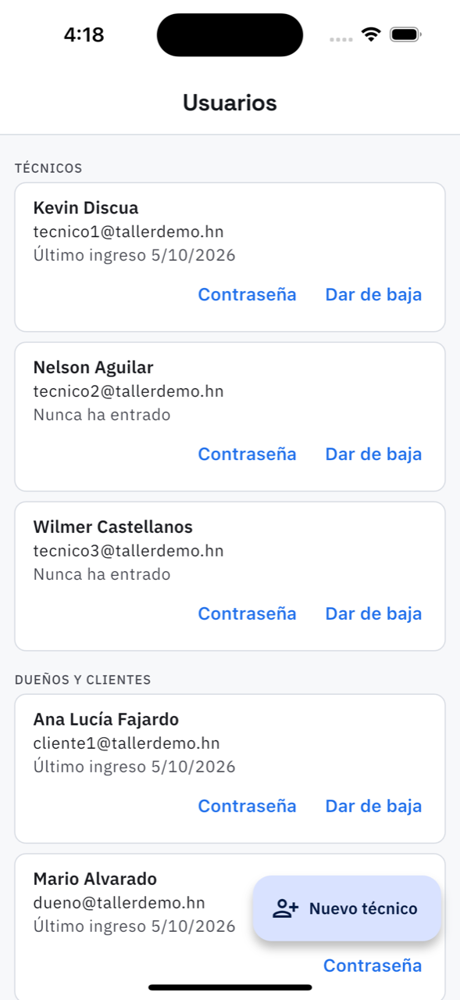

# 19. Usuarios

**Qué es.** Quién puede entrar a la app del taller. Está separado en dos bloques: **Técnicos**
y **Dueños y clientes**.

**Cómo llegar.** Más → Catálogos y taller → **Usuarios**.

## Cada usuario

Nombre, el correo con el que entra y el último ingreso («Nunca ha entrado» si todavía no ha
abierto la app). Desde el renglón:

- **Contraseña** — le pone una nueva, de al menos 8 caracteres. Al cambiarla **se le cierran
  las sesiones abiertas**: si un técnico se fue del taller con la sesión abierta en su
  teléfono, esto la corta.
- **Dar de baja** — deja de poder entrar, pero **su trabajo queda registrado**: las órdenes que
  hizo siguen diciendo que las hizo él. Se puede **Reactivar** después, con su misma
  contraseña.

## Nuevo técnico

Nombre completo, correo con el que entra, contraseña (se la entrega usted) y las **sucursales
donde trabaja** — eso es lo que decide en qué órdenes se le puede asignar.

Al crearlo, la app recuerda: *«Entréguele el correo y la contraseña»*.

## Los clientes

Los clientes aparecen aquí, pero no se crean aquí: se les da acceso desde su ficha en
[Clientes](15-clientes.md). Aquí se les cambia la contraseña o se les da de baja.

## Lo que se hace en el panel web

**Cómo se le paga al técnico** —sueldo fijo, por comisión o por trabajo, y el monto— se
configura en el panel web, en Usuarios. Desde el teléfono no se puede.
