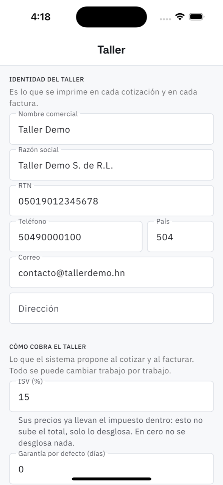

# 20. Ajustes del taller

**Qué es.** Los datos del taller y lo que el sistema propone por defecto. Está en tres grupos
para que se entienda qué toca cada cosa.

**Cómo llegar.** Más → Catálogos y taller → **Taller**.

## Identidad del taller

Es **lo que se imprime en cada cotización y en cada factura**: nombre comercial, razón social,
RTN, teléfono, país, correo y dirección.

## Cómo cobra el taller

Lo que el sistema propone al cotizar y al facturar. Todo se puede cambiar trabajo por trabajo.

| Ajuste | Qué hace |
| --- | --- |
| **ISV (%)** | sus precios **ya llevan el impuesto dentro**: esto no sube el total, solo lo desglosa. En cero no se desglosa nada |
| **Garantía por defecto (días)** | la que lleva un trabajo al facturarlo. Cero es sin garantía |
| **Cobrar bodegaje** y **por día** | por el vehículo que nadie retira después del aviso |
| **Días de gracia** | cuántos días pasan antes de empezar a cobrar bodegaje |

## Qué ve el técnico

**El técnico ve precios y totales.** Encendido, el técnico ve lo que cuesta cada paso y el
total de la orden; apagado, solo ve qué hay que hacer. No es desconfianza: en muchos talleres
el técnico no habla de dinero con el cliente, le reporta al dueño.

**Guardar** aplica los tres grupos de una vez y confirma: *«Ajustes guardados»*.

> El mismo juego de ajustes está en el panel web, en Taller, con los mismos tres grupos.
