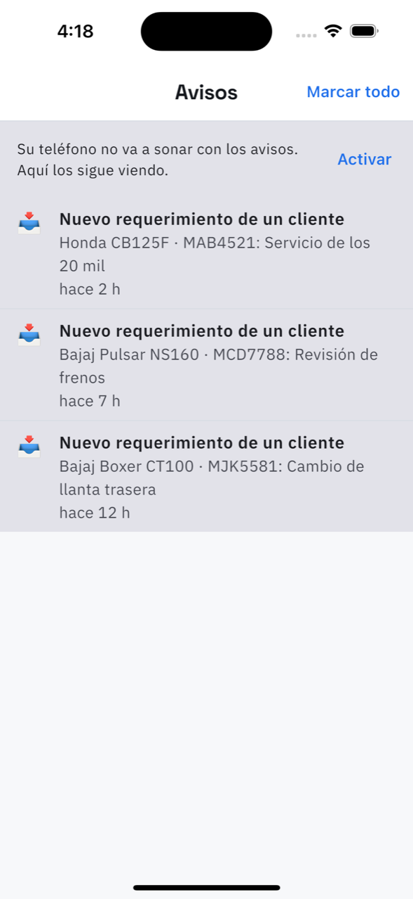

# 21. Avisos

**Qué es.** Lo que pasó mientras usted no estaba mirando: un requerimiento nuevo, una
cotización que el cliente contestó, un vehículo que ya lleva días sin que lo recojan.

**Cómo llegar.** La campana de arriba a la derecha, en cualquier pantalla. El número rojo es
cuántos no ha leído.

## Qué hay

Cada aviso con su texto y hace cuánto llegó: *ahora*, *hace 12 min*, *hace 3 h*, *hace 2 d*.
Al tocarlo, lleva a lo que lo generó — casi siempre una [orden](05-ordenes.md) — y queda
leído.

**Marcar todo** los da por leídos de una vez.

## Las notificaciones del teléfono

Si no le dio permiso a la app, aparece arriba el aviso: *«Su teléfono no va a sonar con los
avisos. Aquí los sigue viendo»*, con el botón **Activar**, que abre los ajustes del teléfono.

La app funciona igual sin permiso: lo único que se pierde es que el teléfono suene.
