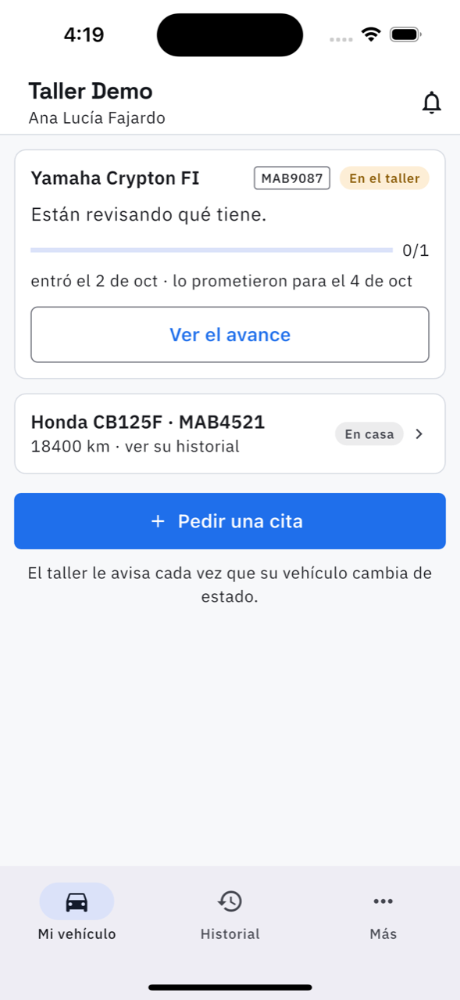
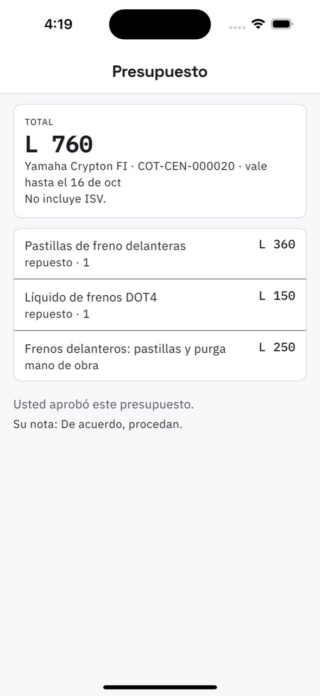
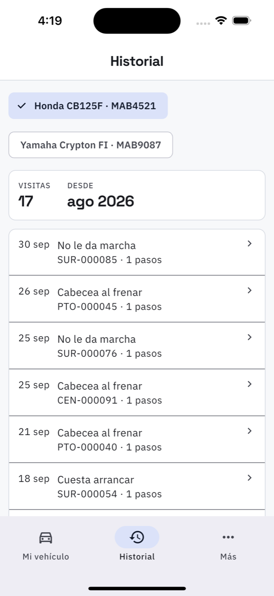

# 23. La app del cliente

El cliente —el que no tiene por qué saber nada del taller— abre en su vehículo. Tres
destinos: **Mi vehículo**, **Historial** y **Más**.

## Mi vehículo

Sus vehículos, con el que está en el taller arriba y en grande:

- El estado **en palabras suyas**, no en las del taller: *«Están revisando qué tiene»*,
  *«Lo están reparando»*, *«Esperando que llegue un repuesto»*, *«Ya está listo: puede pasar a
  recogerlo»*.
- La barra de avance con los pasos hechos.
- Cuándo entró y para cuándo se lo prometieron.
- **Ver el avance** abre el detalle con las fotos de su reparación.

Los vehículos que no están en el taller aparecen abajo como **En casa**, con su kilometraje y
un enlace a su historial.

**Pedir una cita** manda un [requerimiento](03-requerimientos.md) al taller: el vehículo, el
motivo y qué está sintiendo.

Y abajo, la promesa: *«El taller le avisa cada vez que su vehículo cambia de estado»*.

## Cuando hay algo que decidir

Si el taller le mandó un presupuesto, sale arriba **LE TOCA A USTED**, con el aviso de que el
taller *espera su respuesta para seguir*.

El presupuesto trae el total, hasta cuándo vale, las líneas una por una —repuestos y mano de
obra— y **las fotos del daño**. Dos botones:

- **Aprobar** — el taller sigue con el trabajo y el presupuesto queda cerrado en ese monto.
- **Rechazar** — el taller detiene el trabajo y le van a llamar.

Se puede dejar una nota. **Esa respuesta no se puede cambiar**, y queda escrita: *«Usted
aprobó este presupuesto. Su nota: De acuerdo, procedan»*.

Un presupuesto vencido lo dice y no deja contestar: hay que pedirle otro al taller.

## Historial

Todas las visitas del vehículo, de la más nueva a la más vieja, con la fecha, qué se le hizo y
cuántos pasos llevó. *«Cada visita guarda lo que se le hizo, las fotos y quién lo atendió»* —
es lo que sirve el día que vende la moto.

## Lo que el cliente nunca ve

Ni los precios de otros clientes, ni el inventario, ni la caja, ni los costos del taller. Solo
sus vehículos, sus presupuestos y su historial.
