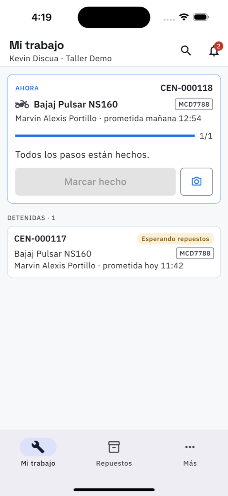
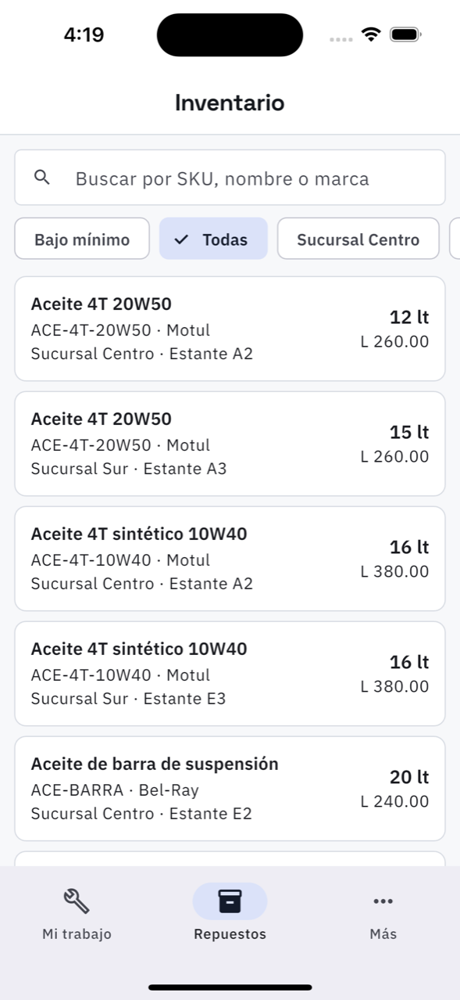

# 23. La app del técnico

El técnico abre directo en lo suyo. Su barra de abajo tiene tres destinos: **Mi trabajo**,
**Repuestos** y **Más**.

## Mi trabajo

Sus órdenes, agrupadas por lo que toca ahora:

- **AHORA** — la que está haciendo, en grande, con el vehículo, el cliente, la fecha
  prometida y la barra de avance.
- **Por empezar**, **Detenidas**, **Listas para entrega** — el resto, con su estado.

En la tarjeta de arriba, dos botones que son el 90 % de su día:

- **Marcar hecho** — marca el paso que sigue, sin entrar a la orden. Cuando ya no queda
  ninguno, dice *«Todos los pasos están hechos»* y el botón se apaga.
- **La cámara** — toma una foto y la guarda en la orden: *«Foto guardada en la orden»*.

Al tocar la tarjeta se abre la [orden completa](05-ordenes.md), con sus pasos, sus repuestos y
sus fotos.

**La lupa** de arriba busca cualquier orden del taller por placa o número, no solo las suyas:
es para cuando alguien pregunta por un vehículo que no es el que está arreglando.

## Repuestos

El mismo [Inventario](16-inventario.md): buscar una pieza, ver cuánta hay y en qué sucursal
está, sin tener que preguntarle al mostrador.

## Lo que el técnico no ve

- **Los precios y los totales**, salvo que el dueño lo haya permitido en
  [Ajustes del taller](20-ajustes-del-taller.md).
- Caja, ventas, por cobrar, reportes, gastos y usuarios: nada de eso está en su menú.
